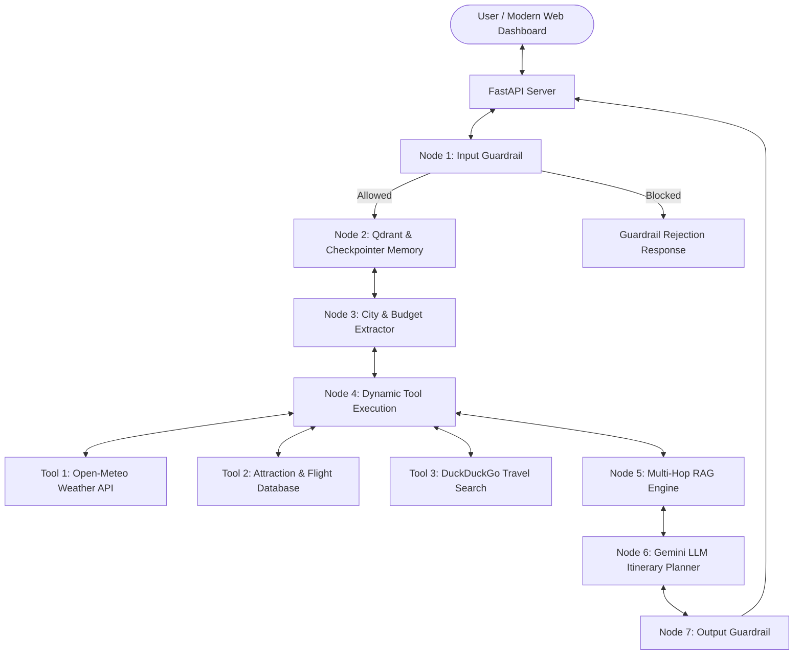

# Technical Architecture Document: Intelligent Travel Planning AI Agent

## 1. Overview
The **Intelligent Travel Planning AI Agent** is a production-grade multi-actor agent framework built to generate personalized, context-aware 2-day itineraries for global destinations.

The architecture emphasizes modularity, guardrail-driven execution, multi-hop retrieval, stateful persistence, and standard enterprise integration patterns.

---

## 2. System Architecture Diagram

---

## 3. Core Component Design

### 3.1 LangGraph State Machine (`agent/graph.py`)
State persistence and transition control is implemented using **LangGraph**. The workflow enforces strict step-by-step state transitions:
1. `input_guardrail` -> 2. `memory_retrieval` -> 3. `city_extraction` -> 4. `tool_execution` -> 5. `rag_retrieval` -> 6. `itinerary_synthesis` -> 7. `output_guardrail`.

### 3.2 Guardrails Framework (`agent/guardrails.py`)
- **Input Guardrails**: Scans user inputs using regex and semantic pattern matching for prompt injections, jailbreak patterns, and off-topic queries.
- **Output Guardrails**: Validates that synthesized itineraries explicitly detail Day 1 and Day 2 plans, and checks estimated costs against user budget constraints.

### 3.3 Vector Database Memory Manager (`memory/long_term.py`)
- **3-Tier Vector Database Resilience**:
  1. **Primary**: **Qdrant Vector Database** running in Docker on port `6333`.
  2. **Secondary Fallback**: **FAISS Vector Store** (`faiss-cpu`) via LangChain community vectorstores.
  3. **Tertiary Fallback**: In-memory vector store.
- User preferences (e.g., budget limits, pet friendliness, dietary needs) are stored and searched transparently regardless of which backend is active.

### 3.4 Multi-Hop RAG Engine (`agent/rag.py`)
- Executes 2-stage retrieval:
  - **Hop 1**: Retrieves primary city landmark and day breakdown chunks.
  - **Hop 2**: Extracts secondary domain topics (transit rules, local tipping, etiquette, food markets) and retrieves supporting context.

### 3.5 Tool Integration (`tools/`)
- **Open-Meteo Weather API**: Real-time 2-day temperature, wind, and precipitation forecasting.
- **DuckDuckGo Travel Search**: Up-to-date web search for live event recommendations.
- **Attraction & Booking Database**: Structured flight, hotel, and attraction cost/rating data.

---

## 4. API Endpoints
- `POST /api/chat`: Primary agent chat & itinerary generation endpoint.
- `POST /api/memory/preferences`: Upsert user preference to Qdrant vector database.
- `GET /api/memory/preferences/{user_id}`: Retrieve stored user preferences from Qdrant.
- `GET /api/guardrails/status`: Inspection endpoint for guardrails configuration.
- `GET /health`: Health and vector DB status check.
